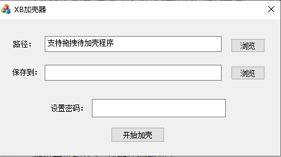

# README

## 前言

加壳器，练手之作，以此记录，如有错误，还望不吝赐教

## 界面



## 功能介绍

### 反调试

使用`PEB.BeginDebug`与`PEB.NtGlobalFlag`检测是否被调试

```c++
		bool BeginDebugged = false;
		__asm
		{
			//获取PEB地址
			mov eax, dword ptr fs : [0x30]
			//获取PEB.BeginDebugged
			mov al, byte ptr ds : [eax + 0x02]
			mov BeginDebugged, al
		}

		//2.NtGlobalFlag在调试状态时值为0x70,正常下为0
		int NtGlobalFlag = 0;
		__asm
		{
			//获取PEB地址
			mov eax, dword ptr fs : [0x30]
			//获取PEB.NtGlobalFlag
			mov eax, dword ptr ds : [eax + 0x68]
			mov NtGlobalFlag, eax
		}
		NtGlobalFlag == 0x70 ? NtGlobalFlag = 1 : NtGlobalFlag = 0;
```

### 反虚拟机

通过查询注册表键查看是否在虚拟机中运行、

```c++
	bool CheckWMWare()
	{
		if (pRegOpenKeyA(HKEY_CLASSES_ROOT, "\\Applications\\VMwareHostOpen.exe", &hkey) == ERROR_SUCCESS)
		{
			return true;
		}
		else
		{
			return false;
		}
	}
```

### 支持随机基址

先修复壳代码的重定位表，给原程序添加个区段并将修复好的壳代码的重定位表拷贝到新区段，将原程序的重定位表指向我们新增的区段，这样程序就会自动帮我们重定位壳代码中的数据。在壳代码中，修复原程序的重定位。

如果程序有`tls`表，会关闭随机基址。

### 密码弹窗

弹窗密码会使用`base64`加密

### 代码段加密/压缩

使用`AES_128`对代码段进行加密(密钥为随机生成)，使用`LZ4`算法对代码段进行压缩

### IAT加密

修复`IAT`时将函数地址换成一段`shellcode`实现对`IAT`的加密，该`shellcode`包含多个花指令，`shellcode`执行完之后调用原本函数

## 使用说明

- `win10 64` `VS2017`
- `MyShell` `X86` Release生成  运行库为多线程MT 禁用优化
- `AddShellTool` `X86` Debug生成

